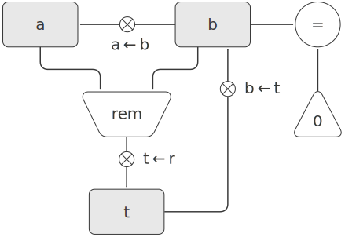

왠지 어셈블리 공부하는 느낌이...


5. 레지스터 기계로 계산하기

lisp 실행기의 실행 흐름을 완벽하게 파악하려면, lisp보다 낮은 수준에서 프로세스가 돌아가는 방법을 설명할 수 있어야 한다.

탑다운 - 바텀업

5.1 : 레지스터 기계 설계
5.2 : 레지스터 기계 시뮬레이트하기
5.3 : 메모리 할당 및 관리
5.4 : 4.1에서 다룬 메타서큘러 실행기로 설명한 알고리즘을 수행하는 레지스터 기계 설계
5.5 : compiler만들기.

## 5.1 레지스터 기계 설계하기.
레지스터 기계를 설계하려면, data path와 controller를 설계해야함.


```lisp
(define (gcd a b)
	(if (= b 0)
		a
		(gcd b (remainder a b))))
```

gcd data-path


gcd controller


연습문제5.1
```lisp
(define (factorial n)
	(define (iter product counter)
		(if (> counter n)
			product
			(iter (* counter product)
				  (+ counter 1))))
	(iter 1 1))
```

factorial data-path
20140301232054.png

factorial controller
20140301232053.png


5.1.1 레지스터 기계를 묘사하는 언어
복잡한 기계를 더 쉽게 설명하기 위해, data-path와 controller의 있는 모든 정보를 글의 형태로 작성할 수 있도록 새 언어를 만든다.


(data-path
	(registers
		((name a)
		 (buttons ((name a<-b) (source (register b)))))
		((name b)
		 (buttons ((name b<-t) (source (register t)))))
		((name t)
		 (buttons ((name t<-r) (source (operation rem))))))
	(operations
		((name rem)
		 (inputs (register a) (register b)))
		((name =)
		 (inputs (register b) (constant 0)))))

(controller
	test-b
		(test =)
		(branch (label gcd-done))
		(t<-r)
		(a<-b)
		(b<-t)
		(goto (label test-b))
	gcd-done)


data-path와 controller정보를 모아, 한번에 보기 편하도록 표기법 바꿈.

(controller
	test-b
		(test (op =) (reg b) (const 0))
		(branch (label gcd-done))
		(assign t (op rem) (reg a) (reg b))
		(assign a (reg b))
		(assign b (reg t))
		(goto (label test-b))
	gcd-done)


연습문제 5.2
연습문제 5.1에서 만든 factorial을 기계어로 설명해라.
(controller
	   (assign counter (const 1))
	   (assign product (const 1))
   test-counter
	   (test (op <) (reg counter) (reg n))
	   (branch (label factorial-done))
	   (assign t1 (op +) (const 1) (reg counter))
	   (assign t2 (op *) (reg counter) (reg product))
	   (assign (reg counter) (reg t1))
	   (assign (reg product) (reg t2))
	   (goto (label test-counter))
   factorial-done)
   
   
5.1.2 기계 디자인에서의 속 내용 감추기
rem을 예로들면서, rem이 제어기 정의처럼 바뀐다고 가정하고, 프로그램을 작성.

연습문제 5.3
(define (sqrt x)
	(define (good-enough? guess)
		(-> guess
			squre
			(- x)
			abs)
			(< 0.001))
	(define (improbe guess)
		(average guess
				 (/ x guess)))
	(define (sqrt-iter guess)
		(if (good-enough? guess)
			guess
			(sqrt-iter (improbe guess))))
	(sqrt-iter 1.0))


(controller
		(assign guess (const 1.0))
	sqrt-iter
		(test (op good-enough?) (reg guess) (reg x))
		(branch (label sqrt-done))
		(assign guess (op improve) (reg guess) (reg x))
		(goto (label sqrt-iter))
	sqrt-done)


## 5.1.3 서브루틴
TODO


## 5.1.4 stack을 이용해서 recursion구현하기
TODO


## 5.1.5 명령어 정리

